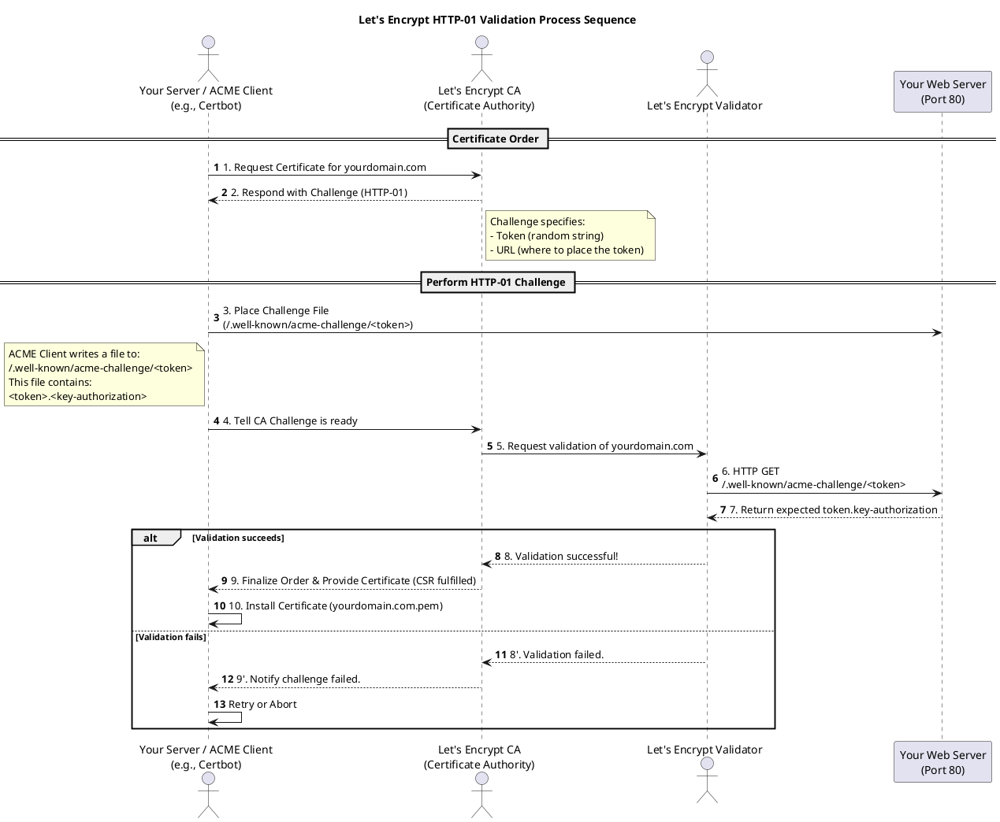

# ✅ Install and Configure
## ⚒️ Setup Environment
Edit ./setup\_env.sh
and run:
```bash
source ./setup_env.sh
```
## ⚙️ Installation
```bash
source ./install_gitlab.sh
```
### ⚙️ Install Runner
```bash
source ./install_runner.sh
./setup_gitlab_admin.sh
```
## 🔒 Certs 
set Environment variable YOUR\_DOMAIN
## 🔍 Get Password
```bash
./get_pw.sh
```
You should change your secrets section of gitlab webserver.
```yaml
apiVersion: networking.k8s.io/v1
kind: Ingress
metadata:
  name: gitlab-webservice-default
  namespace: gitlab
  # ...
spec:
  # ... 
  tls:
  - hosts:
    - gitlab.yoonjin2.kr
    secretName: gitlab-yoonjin2-kr-tls # <--- 
  rules:
  # ...
```

This should be setted up.

Also, see setup\_letsencrypt.sh.
```bash
#!/bin/bash
kubectl apply -f https://github.com/cert-manager/cert-manager/releases/download/v1.14.5/cert-manager.yaml
kubectl apply -f $(YAML $GITLAB_PLAYGROUND)/letsencrypt
kubectl annotate ingress gitlab-webservice-default -n gitlab cert-manager.io/cluster-issuer="letsencrypt-prod" nginx.ingress.kubernetes.io/ssl-redirect="false" --overwrite
kubectl annotate ingress gitlab-minio -n gitlab cert-manager.io/cluster-issuer="letsencrypt-prod" nginx.ingress.kubernetes.io/ssl-redirect="false" --overwrite
kubectl annotate ingress gitlab-kas -n gitlab cert-manager.io/cluster-issuer="letsencrypt-prod" nginx.ingress.kubernetes.io/ssl-redirect="false" --overwrite
kubectl annotate ingress gitlab-registry -n gitlab cert-manager.io/cluster-issuer="letsencrypt-prod" nginx.ingress.kubernetes.io/ssl-redirect="false" --overwrite
```

Each ingresses you want to certify with LetsEncrypt provider should be annotated.
Also, be sure to port-forward each LetsEncrypt services' ports into 80.
```
First LetsEncrypt Service <- 80
Fist Certs created
Second LetsEncrypt Service <- 80
Second Certs Created
```

This is detailed diagram:



